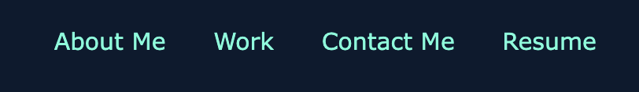

# module-2

## Description 

Please see below a screenshot of the landing page that i have created. 

- My motivation for this project was to build a portfolio profile to showcase my work. 

I made sure that my name was visible with an updated photo of myself was inserted into the webpage as you can see in the image below.

I made sure that by adding the navigation links to the top right side of the page you can click any link and it would take the user to that specific part of the page.

- I built this project because when i complete this bootcamp course it will be a platform to present the work that i have done for future job prospects. 

- When vising the page the user will be able visit the link (Resume) as seen below. When clicked a PDF of my resume will load.

The image shown below are to my LinkedIn page. When clicking this link it will open up a separate window for the user to access my LinkedIn page.

The image shown below are links to my Github page and the landing page of my project.

- I made sure that by adding media query to the css so that when the page is resized or viewed on various screens snd devices then the layout is respoonsive and adapts to the viewport. 

- What i learned from completing this project was how to to link correctly. I need to progress alot on using images and grid layout as it is not exactly how i need it to be.  

- What makes my project stand out is that it is simple but effective. I believe the colour contrast is very good and makes it easy for the user to see correctly. I have followed the instructions given for this project to the best of my current ability. The functionality of the page works very well when i have tested it.

## GitHub 

https://github.com/bex-ford/module-2

## Licence 

NONE